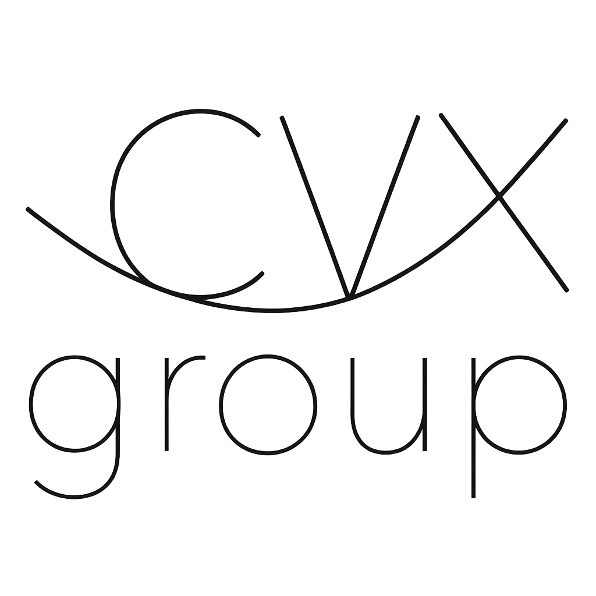

# cvx-package-template

<h1 align="center" margin=0px>

</h1>

Repository description goes here.

The full documentation is available [here](https://www.cvxgrp.org/respository/).

If you wish to cite respository please cite the papers listed [here](https://www.cvxgrp.org/respository/citing).
